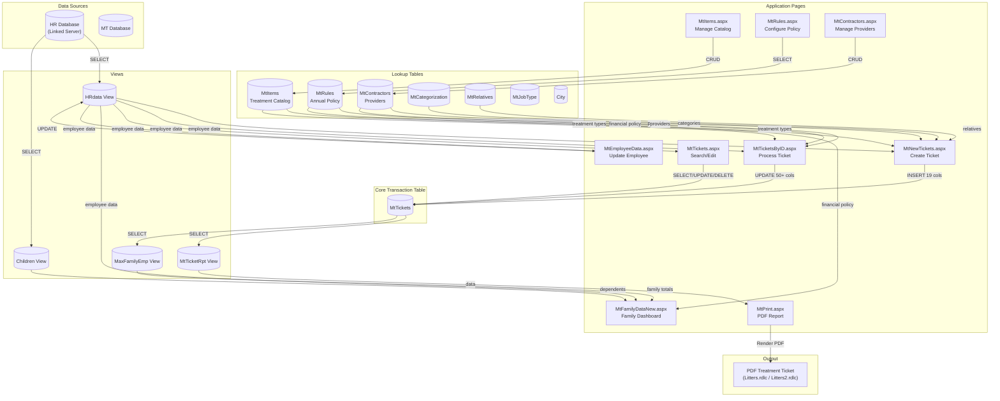
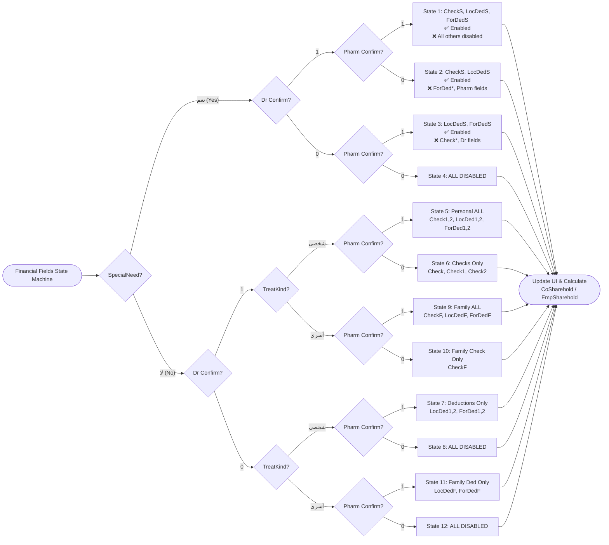
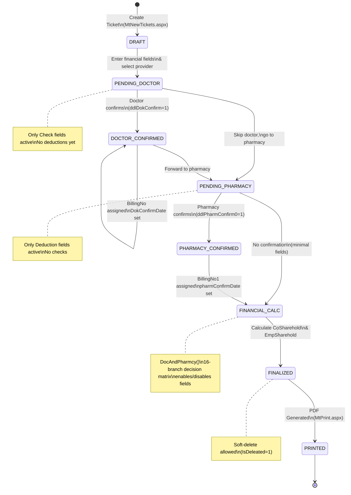
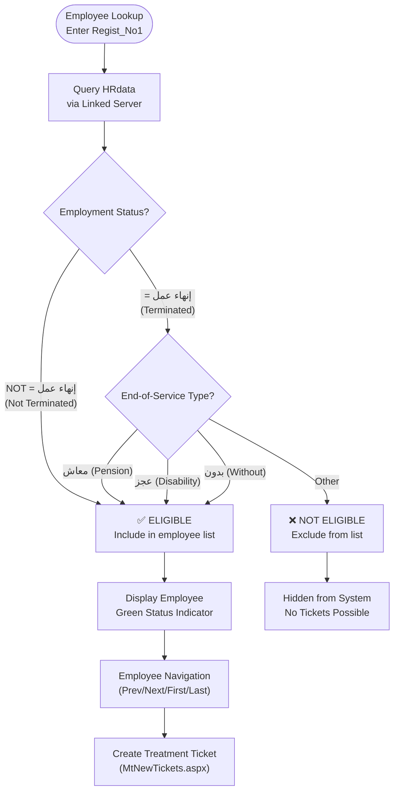
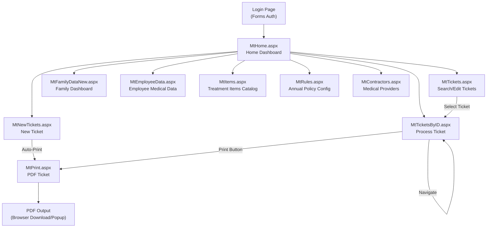
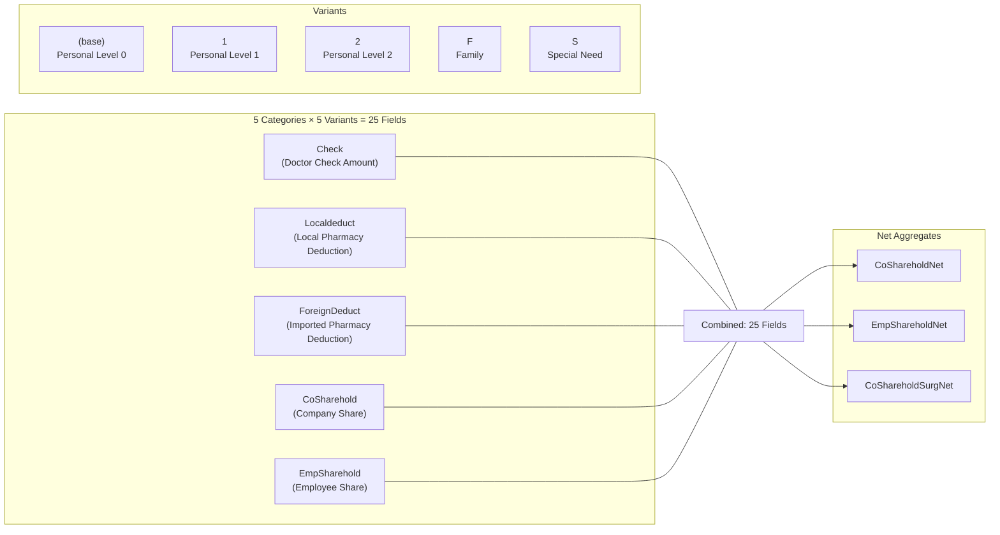

# System Diagrams / الرسومات البيانية

## HR-Medical-Treatment-Web

---

### 1. Entity Relationship Diagram (ERD)

```mermaid
erDiagram
    MtTickets ||--o{ MtItems : "TreatTypeId"
    MtTickets ||--o{ HRdata : "code"
    MtTickets ||--o{ MtContractors : "Contractors"
    MtTickets ||--o{ MtContractors : "Contractors2"
    MtTickets ||--o{ MtCategorization : "categorization"
    MtTickets ||--o{ MtRelatives : "relatives"

    MtContractors ||--o{ City : "CityID"

    MtRules }o--|| MtJobType : "job-level"
    MtItems }o--|| MtJobType : "SpecialNeedLevel"

    HRdata ||--o{ MedicalNotes : "Code"
    HRdata ||--o{ Children : "Code"
    HRdata ||--o{ Wives : "Code"

    MtTickets {
        int Id_3101 PK
        datetime TarnsDate
        datetime TreatDate
        string Contractors FK
        string TreatType
        int TreatTypeId FK
        string TreatKind
        string relatives FK
        string DokConfirm
        datetime DokConfirmDate
        string Contractors2 FK
        string pharmConfirm
        datetime pharmConfirmDate
        string notes
        int code FK
        real Localdeduct
        real ForeignDeduct
        real CoSharehold
        real EmpSharehold
        real Check
        real Localdeduct1
        real ForeignDeduct1
        real CoSharehold1
        real EmpSharehold1
        real Check1
        real Localdeduct2
        real ForeignDeduct2
        real CoSharehold2
        real EmpSharehold2
        real Check2
        real LocaldeductF
        real ForeignDeductF
        real CoShareholdF
        real EmpShareholdF
        real CheckF
        real LocaldeductS
        real ForeignDeductS
        real CoShareholdS
        real EmpShareholdS
        real CheckS
        real CoShareholdNet
        real EmpShareholdNet
        real CoShareholdSurgNet
        string CaseName
        int BillingNo
        int BillingNo1
        string PharmMemo
        smallint YearMT
        string HospitalLevel
        bit FamilyBox
        string categorization FK
        string CreatedBy
        datetime CreatedDate
        string WinHostName
        string WinUserName
        string LastModifiedBy
        datetime LastModifiedDate
        bit IsDeleated
        string DeletedBy
    }

    MtItems {
        int id PK
        string TreatType
        string SpecialNeed
        real EmpMax
        real WifeMax
        real SonMax
        string SpecialNeedVersion
        string Notes
        string SpecialNeedLevel
        string Rang
        string GenTreatType
        string CreatedBy
        datetime CreatedDate
        bit IsDeleted
    }

    MtContractors {
        int id PK
        string Contractors
        string Address
        string District
        int CityID FK
        string Notes
        string Phone
        string Special
        string Kind
        bit isactive
        string BankName
        string BankBranch
        string BankAccountName
        string BankAccountNumber
        string BankSwiftCode
        string BankName2
        string BankBranch2
        string BankAccountName2
        string BankAccountNumber2
        string BankSwiftCode2
        bit IsDeleted
    }

    MtRules {
        int id PK
        real MaxBefore
        real Max
        real EmpPercent
        real Max1
        real MaxAfter1
        real EmpPercent1
        real EmpPercentAfter1
        real LocaldeductPercent
        real ForeignDeductPercent
        real FamilySpecified
        real MaxBefore66
        real Max66
        real EmpPercent66
        real Max166
        real MaxAfter166
        real EmpPercent166
        real EmpPercentAfter166
        real Wife11
        real WifePlus111
        real WifePlus211
        real WifePlus311
        real Wife22
        real WifePlus122
        real WifePlus222
        real WifePlus322
        real Wife33
        real WifePlus133
        real WifePlus233
        real WifePlus333
        real Wife44
        real WifePlus144
        real WifePlus244
        real WifePlus344
        real Wife55
        real WifePlus155
        real WifePlus255
        real WifePlus355
        real Wife66
        real WifePlus166
        real WifePlus266
        real WifePlus366
        string YearMt
    }

    HRdata {
        int Code PK
        string Regist_No1
        string E_Name
        string Name
        string الموقف_الحالي
        string نوع_الوظيفة
        string نوع_التعاقد
        string PetroGasNotes
        string Endemic
        string Notes
        string BoardMember
        string JOB_NAME
        string YearsOld
        string Sex_A
        string Marital_Status_A
        datetime D_Birth
        string Picture
        string sl
        string إستلام_دفتر
        string كشف_بتروجاس
        string كشف_اول
        string كشف_ثاني
    }

    MedicalNotes {
        int MedicalNotesID PK
        int Code FK
        string Notes
    }

    City {
        int ID_1102 PK
        string District_A
        int Nationality_A
        bit IsDeleted
    }

    Children {
        int CODE FK
        string CHILD_NAME
        string SEX
        datetime D_BIRTH
        int age
    }

    MtTicketRpt {
        int Id_3101
        datetime TarnsDate
        string TreatType
        string ContractorName
        string EmployeeName
        string EmployeeCode
        string ContractorAddress
        string ContractorPhone
        string DoctorConfirm
        string PharmConfirm
        real Localdeduct
        real ForeignDeduct
        real CoSharehold
        real EmpSharehold
    }

    MtJobType {
        string نوع_الوظيفة
        tinyint الرقم PK
    }
```



---

### 2. Data Flow Diagram



---

### 3. DocAndPharmcy State Machine



---

### 4. Ticket Lifecycle



---

### 5. Employee Eligibility Flowchart



---

### 6. Screen Flow / User Navigation



---

### 7. Financial Field Matrix



---

### Legend / المفتاح

```
PK  = Primary Key
FK  = Foreign Key
→   = One-to-Many Relationship
✅  = Enabled / Active
❌  = Disabled / Inactive
```
