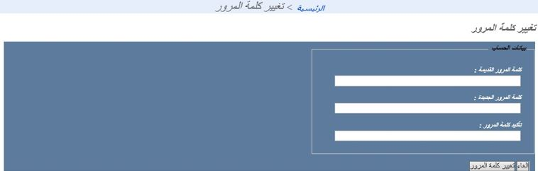
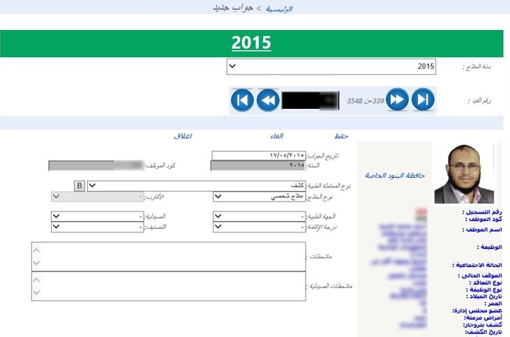
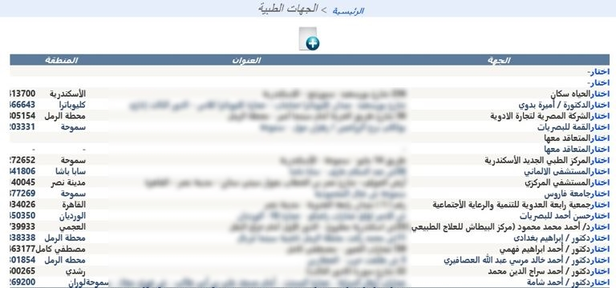
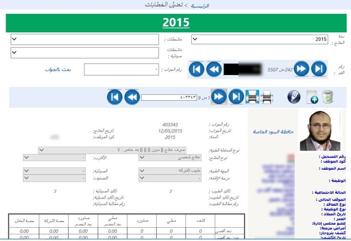
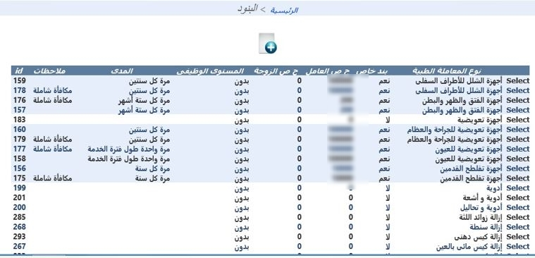
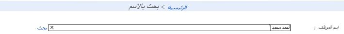
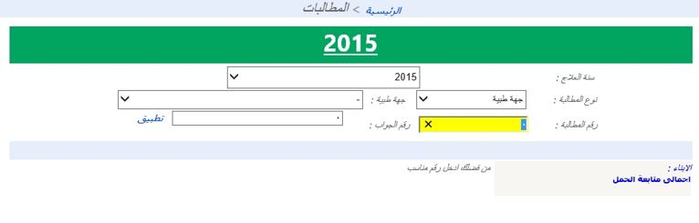
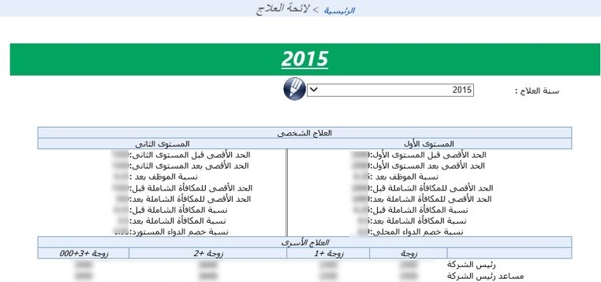

<div dir="rtl">

# برنامج العلاج الطبي — HR Medical Treatment Web

<p align="center">
  
</p>

<p align="center">
  <strong> نظام إلكتروني متكامل لإدارة العلاج الطبي للعاملين </strong>
</p>

<p align="center">
  
  
  
  
  
  
</p>

---

## 📖 نبذة عن المشروع

**برنامج العلاج الطبي** هو تطبيق ويب داخلي صُمّم لإدارة منظومة العلاج الطبي للعاملين بشركة **إسكندرية للصيانة البترولية (بترومنت)**. يعمل النظام على تحويل إدارة العلاج الطبي من النظام الورقي الدفتري التقليدي إلى **نظام إلكتروني متكامل** يضمن الدقة والسرعة في مراجعة وحساب المطالبات الطبية وتطبيق لائحة العلاج بالشركة بدقة.

> 🎯 **الهدف الأساسي:** الاستفادة الكاملة من حصة العلاج المقدمة للعاملين بتطبيق اللائحة بدقة، ومتابعة جميع التعاقدات والمطالبات الطبية مع الجهات الطبية المختلفة.

---

## ✨ المميزات الرئيسية

| # | الميزة | الوصف |
|---|-------|-------|
| 1 | **التحول الرقمي الكامل** | الانتقال من النظام الدفتري والورقي إلى نظام إلكتروني شامل. |
| 2 | **إدارة الجهات الطبية** | متابعة وإضافة الجهات الطبية المختلفة التي تتعامل معها الشركة وتسجيل بياناتها. |
| 3 | **متابعة حصص العاملين** | تتبّع حصص العلاج (الأسري والشخصي) لكل عامل وفق لائحة الشركة. |
| 4 | **إدارة التعاقدات** | متابعة جميع أنواع التعاقدات مع الجهات الطبية المختلفة. |
| 5 | **احتساب الحصص** | حساب حصة الشركة وحصة العامل عن مطالبات الجهات الطبية تلقائياً. |
| 6 | **الخصومات المالية** | متابعة تحصيل وخصم قيم الحصص المختلفة من فواتير العلاج الطبي. |
| 7 | **متابعة البنود** | تتبّع جميع بنود العلاج لكل موظف خلال الفترات الزمنية وتكلفتها. |
| 8 | **استحقاق العلاج** | متابعة تنفيذ استحقاق العاملين للعلاج الأسري والشخصي طبقاً للائحة. |
| 9 | **التكامل مع شئون العاملين** | النظام متكامل مع نظام شئون العاملين ويتأثر بحركات الترقيات والانتقالات. |
| 10 | **إدارة الصلاحيات** | إدارة كاملة لصلاحيات المستخدمين لتوجيه المهام الوظيفية داخل الإدارة. |
| 11 | **التقارير الشاملة** | تقارير إجمالية وتفصيلية وإحصائية توفر معلومات حصرية ودقيقة لمتخذ القرار. |
| 12 | **الأمن وتسجيل الدخول** | مصادقة بالنماذج (Forms Authentication) مع أدوار وصلاحيات وتدقيق عمليات الدخول. |

---

## 🧠 منطق عمل النظام

يتمحور منطق عمل النظام حول **دورة حياة المطالبة الطبية** للموظف، ويمكن تلخيصه في الخطوات التالية:

```
   ┌─────────────────┐     ┌──────────────────┐     ┌─────────────────────┐
   │  بيانات الموظف   │────▶│  إنشاء جواب جديد  │────▶│  الجهة الطبية المعتمدة│
   │  + بيانات العائلة│     │  (خطاب علاج)      │     │  (مستشفى / صيدلية)  │
   └─────────────────┘     └──────────────────┘     └─────────┬───────────┘
                                                              │
                                                              ▼
   ┌─────────────────┐     ┌──────────────────┐     ┌─────────────────────┐
   │  التقارير والإحصائيات│◀────│  حساب الحصص + الخصم│◀────│  تسجيل المطالبة (تذكرة)│
   │  الإجمالية/التفصيلية│     │  حصة الشركة/العامل │     │  وربطها بالبنود       │
   └─────────────────┘     └──────────────────┘     └─────────────────────┘
```

### المنطق بالتفصيل:

1. **تسجيل بيانات الموظف والعائلة** — يبدأ النظام من قاعدة بيانات العاملين المتكاملة مع نظام شئون العاملين، ويشمل بيانات الزوج والأبناء لاحتساب الاستحقاق الأسري.

2. **إدارة اللائحة والبنود** — تُعرّف لائحة العلاج (الحدود والنسب) وبنود العلاج لكل بند (شخصي/أسري/إصابة/مرض مزمن) ضمن فترات زمنية محددة.

3. **إنشاء الجواب (الخطاب) الطبي** — يُنشئ الموظف المعتمد خطاب تحويل/جواب علاج جديد موجه لإحدى الجهات الطبية المتعاقد معها.

4. **تسجيل المطالبات (التذاكر)** — عند ورود فاتورة من الجهة الطبية، تُسجَّل المطالبة وتُربط بالبنود، ويقوم النظام تلقائياً باحتساب:
   - حصة الشركة من العلاج
   - حصة العامل من العلاج
   - قيمة الخصم من العلاج الشخصي/الأسري

5. **الخصم والتحصيل** — يتم خصم قيمة حصة العامل من مستحقاته وتحصيل حصة الشركة من الجهات الطبية.

6. **التقارير واتخاذ القرار** — يوفّر النظام تقارير تفصيلية وإحصائية (تكاليف العمليات، مطالبات الجهات، المطالبات التفصيلية، مقارنات سنوية، الأمراض المزمنة، الإصابات...) لمتخذ القرار.

---

## 🖥️ شاشات النظام وطريقة الاستخدام

يحتوي النظام على واجهة عربية (RTL) مع قائمة تنقل أفقية. فيما يلي شرح لكل شاشة وكيفية استخدامها:

### 1️⃣ تسجيل الدخول — `Account/Login.aspx`
- أدخل **اسم المستخدم** و**كلمة المرور** ثم اضغط «تسجيل الدخول».
- يتم تسجيل كل عملية دخول (ناجحة/فاشلة) في جدول التدقيق `LoginAuditTable` مع اسم الجهاز وIP.

### 2️⃣ الصفحة الرئيسية — `Pages/MtHome.aspx`
- تعرض شعار الشركة ورسالة ترحيب، مع رابط لتحميل متصفح Chrome لتحقيق أفضل أداء.

<p align="center">
  
</p>

### 3️⃣ جواب جديد (خطاب علاج) — `Pages/MtNewTickets.aspx`
- إنشاء خطاب/جواب علاج جديد للموظف موجه لإحدى الجهات الطبية.

<p align="center">
  
</p>

### 4️⃣ تعديل الخطابات — `Pages/MtTickets.aspx`
- تعديل ومتابعة الخطابات الطبية الصادرة وربطها بالبنود والتكاليف.
- تدعم الشاشة تقارير `ReportViewer` للطباعة المباشرة.

<p align="center">
  
</p>

### 5️⃣ المطالبات — `Pages/MtTicketsByID.aspx`
- عرض المطالبات الطبية مرتبة برقم الموظف/المطالبة، مع تفاصيل البنود والتكاليف وحصص الشركة والعامل.

<p align="center">
  
</p>

### 6️⃣ بيانات الموظف — `Pages/MtEmployeeData.aspx`
- استعراض وتحرير بيانات الموظف الطبية، مع التنقل بين السجلات (أول/سابق/تالي/أخير) واختيار سنة العلاج.
- تعرض الشاشة ملخص بنود العلاج والتكاليف للسنة المختارة.

<p align="center">
  
</p>

### 7️⃣ الجهات الطبية — `Pages/MtContractors.aspx`
- إدارة الجهات الطبية المتعاقد معها (مستشفيات، عيادات، صيدليات) وبيانات التعاقد.

### 8️⃣ البنود — `Pages/MtItems.aspx`
- تعريف بنود العلاج (أنواع العلاج والخدمات الطبية) وربطها باللائحة.

<p align="center">
  
</p>

### 9️⃣ لائحة العلاج — `Pages/MtRules.aspx`
- تعريف لائحة العلاج الشاملة: الحدود، النسب، الاستحقاق السنوي للعلاج الشخصي والأسري.

### 🔟 بحث بالاسم — `Pages/MtSearch.aspx`
- البحث السريع عن الموظفين بالاسم للوصول لبياناتهم الطبية.

<p align="center">
  
</p>

### 1️⃣1️⃣ بيانات عائلية — `Pages/MtFamilyDataNew.aspx`
- إدارة بيانات أفراد عائلة الموظف (الزوج/الزوجة/الأبناء) لاحتساب استحقاق العلاج الأسري.

### 1️⃣2️⃣ البحث والتصفية
- شاشات تصفية متقدمة حسب الإدارة/المرتبة/الاسم لاستخراج التقارير المطلوبة.

<p align="center">
  
</p>

### 1️⃣3️⃣ التقارير السنوية والإحصائية
- تقارير تجميعية شهرية وسنوية لتكاليف العلاج ومقارناتها.

<p align="center">
  
</p>

---

## 🛠️ التقنيات المستخدمة

| الفئة | التقنية |
|------|---------|
| **إطار العمل** | ASP.NET Web Forms (.NET Framework 4.0) |
| **لغة البرمجة** | VB.NET |
| **قاعدة البيانات** | Microsoft SQL Server (قاعدة `MT`) |
| **المصادقة** | Forms Authentication + SQL Membership & Roles |
| **واجهة المستخدم** | AjaxControlToolkit + jQuery 1.4.1 + CSS مخصص (RTL/عربي) |
| **التقارير** | Microsoft ReportViewer (RDLC/RDL) — SQL Server Reporting Services |
| **البنية** | Master Page (`MT.master`) + SiteMap + User Controls |

---

## 📁 هيكل المشروع

```
HR-Medical-Treatment-Web/
├── Account/                        # تسجيل الدخول وتغيير كلمة المرور
│   ├── Login.aspx                  # شاشة الدخول
│   └── ChangePassword.aspx         # تغيير كلمة المرور
├── Pages/                          # صفحات النظام الرئيسية
│   ├── MT.master                   # القالب الرئيسي + قائمة التنقل
│   ├── MtHome.aspx                 # الصفحة الرئيسية
│   ├── MtNewTickets.aspx           # جواب (خطاب) علاج جديد
│   ├── MtTickets.aspx              # تعديل الخطابات
│   ├── MtTicketsByID.aspx          # المطالبات حسب الرقم
│   ├── MtEmployeeData.aspx         # بيانات الموظف
│   ├── MtContractors.aspx          # الجهات الطبية
│   ├── MtItems.aspx                # بنود العلاج
│   ├── MtRules.aspx                # لائحة العلاج
│   ├── MtSearch.aspx               # البحث بالاسم
│   ├── MtFamilyDataNew.aspx        # البيانات العائلية
│   ├── MtPrint.aspx                # الطباعة
│   └── WebUserSecurityManager.ascx # إدارة صلاحيات المستخدم
├── Reports/                        # تقارير RDL (SSRS)
│   └── M_العلاج الطبي/
│       ├── 01_خاص بالعلاج/         # تقارير العلاج (19 تقرير)
│       └── 02_خاص بالمالية/        # التقارير المالية (17 تقرير)
├── Images/                         # صور النظام (شعار، أيقونات)
├── Styles/                         # ملفات الأنماط (CSS)
├── Scripts/                        # سكربتات jQuery
├── Bin/                            # مكتبات (AjaxControlToolkit, ReportViewer)
├── App_Code/                       # كود مساعد (ExceptionHelper.vb)
├── Sql Server Database/
│   └── MT.sql                      # سكربت إنشاء قاعدة البيانات
├── Web.config                      # إعدادات التطبيق وقواعد البيانات
├── Web.sitemap                     # خريطة الموقع
└── Global.asax                     # معالجات أحداث التطبيق
```

---

## 📊 التقارير

يضم النظام مجموعة ضخمة من التقارير (أكثر من **36 تقريراً**) موزعة على مجلدين:

### 📂 تقارير العلاج (`01_خاص بالعلاج`) — 19 تقريراً
تشمل: بيان بتكاليف المعاملة الطبية، بيان بالمطالبات الخاصة بالجهات الطبية (إجمالي/تفصيلي/أرقام مطالبات)، بيان بالمطالبات الخاصة بالصيدليات (إجمالي/تفصيلي/أرقام مطالبات)، تكلفة المعاملات الطبية بند بند، بيان تكلفة العمليات خلال فترة (إجمالي/تفصيلي/Excel)، إحصائية بعدد العاملين (أزواج/أبناء)، فوق الستين بيان خلال فترة، وغيرها.

### 📂 التقارير المالية (`02_خاص بالمالية`) — 17 تقريراً
تشمل: البيانات الشاملة للعلاج الطبي، بيان بالجهات الطبية المتعاقد معها الشركة، بيان خصم العلاج (الأسري/الشخصي/للمكافأة الشاملة) عن عام، بيان العلاج الأسري حصة الشركة لسنة، بيان خاص بالأمراض المزمنة (أسري/شخصي)، بيانات الإصابات، بيان بأعمار العاملين، مقارنة إجمالي تكاليف العلاج سنوياً، تقرير التأمين الصحي الشامل، موقف العاملين من كشف بتروجاس دفتر صحي، وغيرها.

---

## 🗄️ قاعدة البيانات

يستخدم النظام قاعدة بيانات **SQL Server** باسم `MT`، ويتضمن المشروع سكربت إنشائها الكامل في:

```
Sql Server Database/MT.sql
```

كما يعتمد على قاعدة `HRWebDb` للمصادقة والصلاحيات (Membership/Roles/Profile). تُعرف سلاسل الاتصال في ملف `Web.config`:

| الاسم | القاعدة | الغرض |
|------|---------|-------|
| `MTConnectionString` | `MT` | بيانات العلاج الطبي |
| `ApplicationServices` | `hrwebdb` | المصادقة والأدوار والملف الشخصي |
| `HRWEbDbConnectionString` | `HRWebDb` | بيانات المستخدمين وتدقيق الدخول |

---

## 🚀 التشغيل والنشر

### المتطلبات
- Windows Server + IIS
- .NET Framework 4.0 أو أحدث
- SQL Server 2008 R2 أو أحدث
- متصفح حديث (يُنصح بـ Google Chrome)

### خطلات النشر
1. **استعادة قاعدة البيانات:** نفّذ سكربت `Sql Server Database/MT.sql` على خادم SQL Server لإنشاء قاعدة البيانات `MT`.
2. **إعداد الاتصال:** عدّل سلاسل الاتصال في `Web.config` لتشير إلى خادم SQL الخاص بك.
3. **نشر التطبيق:** انشر المشروع على IIS كموقع (Site) أو تطبيق (Application).
4. **المصادقة:** أنشئ المستخدمين والأدوار عبر آلية ASP.NET Membership (أو استخدم أداة `WSAT`).
5. **الوصول:** افتح `Account/Login.aspx` لتسجيل الدخول والبدء.

> ⚠️ **ملاحظة:** المشروع مصمم للاستخدام المؤسسي الداخلي ويستهدف بيئة شبكة محلية (Intranet).

---

## 🔐 الأمان والصلاحيات

- **المصادقة:** Forms Authentication مع تشفير كلمات المرور عبر SQL Membership.
- **الأدوار:** نظام أدوار (Roles) يتحكم في ظهور عناصر القائمة والوصول للصفحات عبر `WebUserSecurityManager.ascx`.
- **تدقيق الدخول:** كل محاولة دخول (ناجحة/فاشلة) تُسجَّل مع اسم الجهاز، IP، والوقت في `LoginAuditTable`.
- **معالجة الأخطاء:** صفحات `Error.aspx` و`PermissionError.aspx` مخصصة للأخطاء ورفض الصلاحية.

---

## 📸 معرض الصور

تحتوي لقطات الشاشة على 9 صور توضيحية للنظام، يمكن الاطلاع عليها في مجلد `screenshots/`:

| الملف | الوصف |
|-------|-------|
| `01_home_dashboard.jpg` | الصفحة الرئيسية مع شعار الشركة وقائمة التنقل |
| `02_employee_treatment_data.jpg` | بيانات علاج الموظف لسنة محددة مع تفاصيل البنود |
| `03_employee_claims_table.jpg` | جدول مطالبات الموظف مع الملف الشخصي |
| `04_search_filter.jpg` | شاشة التصفية حسب الإدارة/المرتبة/الاسم |
| `05_claims_records.jpg` | سجل المطالبات الطبية |
| `06_medical_items_list.jpg` | قائمة بنود/إجراءات العلاج الطبي |
| `07_annual_report.jpg` | التقرير السنوي للتكاليف الشهرية |
| `08_new_ticket_form.jpg` | نموذج إنشاء جواب (خطاب) علاج جديد |
| `09_search_by_name.jpg` | شاشة البحث عن موظف بالاسم |

---

## 📝 ملخص تنفيذي

> **برنامج العلاج الطبي** هو نظام ويب مؤسسي متكامل يحوّل إدارة العلاج الطبي من العمل الورقي إلى العمل الرقمي الكامل. يربط النظام بين بيانات العاملين (المتكاملة مع شئون العاملين)، والجهات الطبية المتعاقد معها، ولائحة العلاج، والمطالبات والفواتير — ليقوم تلقائياً باحتساب حصص الشركة والعامل، وإصدار الخطابات، وخصم الاستحقاقات، وإصدار تقارير إحصائية وتفصيلية دقيقة تدعم متخذ القرار. النظام مبني على ASP.NET Web Forms وSQL Server ويدعم واجهة عربية كاملة مع نظام صلاحيات متقدم وتدقيق لعمليات الدخول.
---

## &#x1F5C3; مخطط قاعدة البيانات

قاعدة البيانات **MT** تحتوي على الجداول التالية:

| الجدول | الوصف |
|-------|-------|
| **HRdata** | بيانات الموظفين (مُستردة من نظام HR عبر Linked Server) |
| **MtTickets** | خطابات وتذاكر العلاج الطبي - الجدول الأساسي للنظام |
| **MtContractors** | بيانات الجهات الطبية المتعاقدة (مستشفيات، عيادات، معامل، صيدليات) |
| **MtItems** | بنود العلاج الطبي والتكاليف المرتبطة بكل نوع علاج |
| **MtRules** | لائحة العلاج والقواعد المُطبَّقة على حساب المستحقات |
| **MtOldRules** | اللوائح القديمة للعلاج (للأرشفة والمرجعية) |
| **MtRelatives** | بيانات أفراد عائلة الموظف (الزوج/الزوجة، الأبناء) |
| **MtCategorization** | تصنيفات العلاج الطبي |
| **MtJobType** | أنواع الوظائف وأربطتها بنِسب العلاج |
| **MedicalNotes** | الملاحظات الطبية الخاصة بكل موظف |
| **City** | بيانات المدن والمناطق الجغرافية |
| **OLE DB Destination** | جدول مساعد لعمليات نقل البيانات |

كما يستخدم النظام قواعد بيانات إضافية عبر **Linked Server**:
- **HR** - نظام شئون العاملين الرئيسي
- **HRWebDb** - قاعدة بيانات المستخدمين والأمان

---

## &#x1F3AF; وحدات النظام وآلية العمل

### &#x1F680; 1. تسجيل الدخول والمصادقة
يبدأ المستخدم بتسجيل الدخول عبر صفحة مخصصة تتصل بقاعدة بيانات **HRWebDb** للتحقق من بيانات المستخدم. بعد نجاح المصادقة، يتم تسجيل عملية الدخول في جدول **LoginAuditTable** مع تسجيل اسم الجهاز وعنوان IP ووقت الدخول، ثم يُحوَّل المستخدم إلى الصفحة الرئيسية للنظام.

### &#x1F4DD; 2. إنشاء خطاب علاج جديد (جواب جديد)
هذه هي الصفحة الأكثر استخداماً في النظام. يقوم المستخدم بالبحث عن الموظف برقم القيد الوظيفي، فيعرض النظام بيانات الموظف كاملة (الاسم، الوظيفة، الموقع، جهة العمل). ثم يتم:
- اختيار نوع العلاج (شخصي / أسري)
- تحديد الجهة الطبية (مستشفى / صيدلية / معمل)
- إدخال بنود العلاج والتكاليف
- حساب حصة الشركة وحصة العامل تلقائياً وفق اللائحة
- التحقق من عدم تجاوز الحد المسموح
- حفظ وطباعة الخطاب

### &#x270F;&#xFE0F; 3. تعديل الخطابات
تتيح هذه الصفحة البحث عن الخطابات السابقة وتعديلها، سواء بتغيير البنود أو إضافة بنود جديدة أو حذف بعضها، مع إعادة حساب التكاليف والحصص تلقائياً.

### &#x1F4B3; 4. المطالبات (MtTicketsByID)
صفحة متقدمة لعرض المطالبات مرتبة حسب رقم الفاتورة أو الجهة الطبية، وتُستخدم لمراجعة المطالبات المالية المُقدمة من الجهات الطبية وطباعة تقارير شاملة عنها.

### &#x1F465; 5. بيانات الموظف
عرض شامل لبيانات الموظف المستمدة من نظام HR مع إمكانية:
- عرض الحالة الوظيفية والوظيفة والموقع
- إضافة ملاحظات طبية
- الاطلاع على سجل العلاج السابق
- عرض بيانات الأفراد من العائلة المؤهلين للعلاج

### &#x1F3E5; 6. الجهات الطبية
إدارة CRUD كاملة للجهات الطبية المتعاقدة مع الشركة (إضافة، تعديل، حذف، بحث)، مع تصنيفها حسب النوع والمنطقة الجغرافية.

### &#x1F4D6; 7. لائحة العلاج
إدارة وتعديل قواعد حساب مستحقات العلاج التي تحدد:
- نسبة حصة الشركة من كل معاملة
- الحد الأقصى للعلاج السنوي
- الشروط المطبقة حسب نوع الوظيفة
- قواعد العلاج الأسري مقابل الشخصي

---

------

## &#x1F4DD; طريقة التثبيت والتشغيل

### &#x1F4E6; المتطلبات الأساسية

1. **نظام التشغيل**: Windows Server 2008 R2 أو أحدث
2. **إطار العمل**: .NET Framework 4.0
3. **قاعدة البيانات**: Microsoft SQL Server 2014
4. **خادم الويب**: IIS 7.5 أو أحدث
5. **المتصفح**: Google Chrome (مُوصى به للأداء الأفضل)

### &#x1F527; خطوات التثبيت

#### 1. إعداد قاعدة البيانات
```sql
-- فتح ملف SQL Server Database/MT.sql في SQL Server Management Studio
-- وتنفيذ السكريبت لإنشاء قاعدة البيانات MT بالكامل
-- يتضمن الجداول والوظائف والمستخدمين والأدوار
```

#### 2. إعداد اتصال قواعد البيانات

في ملف `Web.config`، قم بتعديل سلاسل الاتصال لتناسب بيئتك:

```xml
<connectionStrings>
    <!-- قاعدة بيانات الأمان والمستخدمين -->
    <add name="HRWEbDbConnectionString"
         connectionString="Data Source=YOUR_SERVER;Initial Catalog=HRWebDb;
         Persist Security Info=True;User ID=YOUR_USER;Password=YOUR_PASSWORD"
         providerName="System.Data.SqlClient" />

    <!-- قاعدة بيانات العلاج الطبي -->
    <add name="MTConnectionString"
         connectionString="Data Source=YOUR_SERVER;Initial Catalog=HRWebDb;
         Persist Security Info=True;User ID=YOUR_USER;Password=YOUR_PASSWORD"
         providerName="System.Data.SqlClient" />
</connectionStrings>
```

#### 3. نشر التطبيق على IIS
1. افتح **Internet Information Services (IIS) Manager**
2. أنشئ موقع ويب جديد أو تطبيق تحت موقع موجود
3. حدد مسار مجلد المشروع كمسار المحتوى الفعلي
4. تأكد من تعيين **.NET Framework 4.0** كإطار عمل للتطبيق التجمعي (Application Pool)
5. اضبط التطبيق للعمل تحت **Classic Pipeline Mode**

#### 4. إعداد Linked Server (اختياري)

إذا كان نظام شئون العاملين (HR) يعمل على خادم منفصل، أنشئ Linked Server في SQL Server:

```sql
EXEC sp_addlinkedserver 
    @server = 'HR', 
    @srvproduct = 'SQL Server';
```

#### 5. إنشاء مستخدمين

أنشئ مستخدمين للنظام عبر ASP.NET Configuration أو مباشرة في قاعدة بيانات HRWebDb، مع تعيين الأدوار المناسبة لكل مستخدم للتحكم في صلاحيات الوصول للصفحات المختلفة.

---

## &#x2699;&#xFE0F; التكامل مع أنظمة أخرى

```
┌─────────────────────┐     Linked Server      ┌─────────────────────┐
│   نظام العلاج الطبي  │ ◄────────────────────► │  نظام شئون العاملين   │
│      (MT)           │                        │      (HR)           │
│                     │     بيانات الموظفين    │                     │
│                     │     (اسم، وظيفة،       │                     │
│                     │      موقع، حالة)       │                     │
└─────────┬───────────┘                        └─────────────────────┘
          │
          │ ASP.NET Membership
          ▼
┌─────────────────────┐
│    HRWebDb          │
│ (المستخدمين والأدوار) │
└─────────────────────┘
```

---

## &#x1F3C1; خريطة الملاحة (Navigation Map)

```
├── &#x1F3E0; الرئيسية (MtHome)
├── &#x1F4E4; جواب جديد (MtNewTickets) - إنشاء خطاب علاج
├── &#x270F;&#xFE0F; تعديل الخطابات (MtTickets)
├── &#x1F4B3; المطالبات (MtTicketsByID)
├── &#x1F465; بيانات الموظف (MtEmployeeData)
├── &#x1F3E2; الجهات الطبية (MtContractors)
├── &#x1F4CB; البنود (MtItems)
├── &#x1F4D6; لائحة العلاج (MtRules)
├── &#x1F50D; بحث بالاسم (MtSearch)
├── &#x1F510; تغيير كلمة المرور (ChangePassword)
└── &#x1F46A; بيانات عائلية (MtFamilyDataNew)
```

---


## 📬 التواصل

للاستفسارات حول المشروع أو الدعم الفني، يُرجى التواصل عبر مستودع GitHub:
**[https://github.com/Ahmed-Elsayed-de/HR-Medical-Treatment-Web](https://github.com/Ahmed-Elsayed-de/HR-Medical-Treatment-Web)**

---

</div>

---

## 🇬🇧 English Summary

**HR Medical Treatment Web** is an enterprise intranet web application built with **ASP.NET Web Forms (VB.NET, .NET Framework 4.0)** and **SQL Server**, designed for **Petromaint (Alexandria Petroleum Maintenance Company)** to fully digitize the management of employee medical treatment.

### Core Concept
It transforms medical-treatment management from a paper/ledger-based process into a fully electronic workflow that links **employee data** (integrated with HR), **contracted medical providers**, the **company's treatment regulations**, and **medical claims/invoices** — automatically computing the company's share vs. the employee's share, issuing treatment referral letters, deducting entitlements, and producing accurate statistical and detailed reports.

### Key Capabilities
- Complete digital transformation of medical-treatment administration.
- Management of contracted medical providers (hospitals, clinics, pharmacies).
- Tracking of personal and family treatment shares per employee.
- Automatic calculation of company/employee shares and deductions.
- Treatment referral letters ("tickets") creation and editing.
- Full treatment regulations (لائحة العلاج) enforcement.
- User roles & permissions management with login auditing.
- 36+ RDLC/RDL reports (treatment + financial) for decision-makers.
- Arabic RTL interface, Forms Authentication, SQL Membership & Roles.

### Tech Stack
ASP.NET Web Forms · VB.NET · .NET Framework 4.0 · SQL Server · AjaxControlToolkit · Microsoft ReportViewer (RDLC/RDL) · jQuery 1.4.1 · Forms Authentication.

### Pages
`MtHome` (Home) · `MtNewTickets` (New Ticket) · `MtTickets` (Edit Letters) · `MtTicketsByID` (Claims) · `MtEmployeeData` (Employee Data) · `MtContractors` (Medical Providers) · `MtItems` (Items) · `MtRules` (Regulations) · `MtSearch` (Search) · `MtFamilyDataNew` (Family Data) · `MtPrint` (Print) · `Login` · `ChangePassword`.

### Screenshots
Nine illustrative screenshots are provided in the `screenshots/` folder, covering the home dashboard, employee treatment data, claims tables, search/filter, claims records, medical items list, annual report, new ticket form, and search-by-name page.

### Repository
[github.com/Ahmed-Elsayed-de/HR-Medical-Treatment-Web](https://github.com/Ahmed-Elsayed-de/HR-Medical-Treatment-Web)

